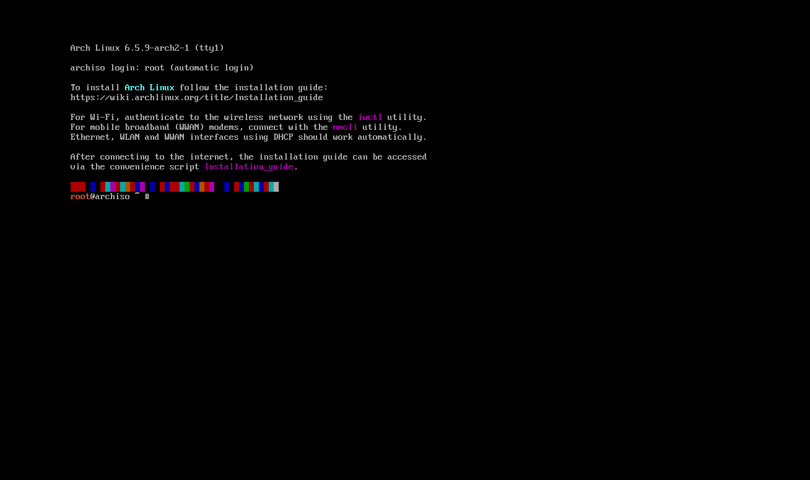
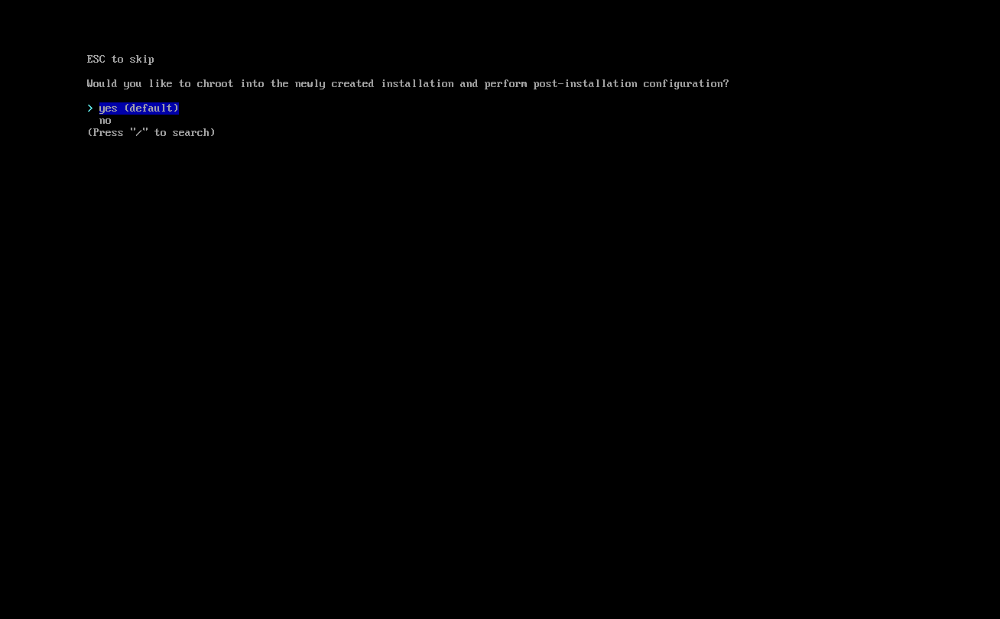

# Arch Linux Hyper-V Installation and Customization Guide 🐧🚀


Welcome to the Arch Linux Hyper-V Installation and Customization Guide! This README provides step-by-step instructions for installing Arch Linux in a Hyper-V environment and customizing it. All commands are ready for copy-pasting to facilitate an easy setup. Let’s start! 🚀

## Prerequisites 📋
- Hyper-V enabled on your machine.
- Downloaded Arch Linux ISO.

## Installation Steps 💻


### Step 1: Create Network Adapter 🌐
  - Configure a virtual network adapter in Hyper-V Manager.
    1. Open Hyper-V and select Virtual Switch Manager
    2. Click New virtual network switch
    3. Choose External + create new virtual switch (Give it a name)
    4. Make sure your External network tag is set to your ethernet or wifi depending on which one is connected to internet on your host OS.
    5. Enable `Allow management operating system to share this network adapter`


### Step 2: Add ISO to Hyper-V & Storage 💾
  - Download an image from here: https://archlinux.org/download/
  - Attach the Arch Linux ISO to your Hyper-V virtual machine.
  - Create vhdx storage to install Arch to (dynamic preferably)
  - Change the network adapter to the one we previously created
  - Disable everything for now in the "Security tab"

#### Extra: Open "Hyper-V Settings (different than your arch image)
  - Disable enhanced session mode


  
### Step 3: Begin Installation with `archinstall` ⚙️
1. Navigate down to `Disk Configuration` and select "Use a best-effort default partition layout"
  - Select "Msft Virtual Disk"
  - Select "ext4"
  - Select "yes (default)" for a separate /home partition.


2. Navigate to "Root password" 🔑
  - Enter a password for the root account

  
3. Navigate to "User account" 👤
  - Select "Add a user"
  - Select "yes (default)" for superuser (sudo)
  - Select "Confirm and exit"


4. Navigate to "Optional Repositories" 📦
  - Select "multilib"


5. Select Install
  - After installing it will ask you if you wish to `chroot into the newly created installation`
  - Select "yes (default)"

<p align="center">
  
</p>


### Post-Installation Setup 🛠️
Make sure you replace "robot" with the username you set during the installation procedure.
```bash
su - robot 
cd /tmp
sudo pacman -S git
git clone https://aur.archlinux.org/yay.git
cd yay
makepkg -si
curl https://raw.githubusercontent.com/pentestfunctions/arch-hyperv/main/setup.sh >> setup.sh
chmod +x setup.sh
sudo ./setup.sh
```
<p align="center">
  
</p>

#### Extra notes:
1. Click the start menu icon and search `display` and configure a 16:9 resolution (*preferably 1920x1080)
2. Right now the konsolequickcommands isn't being configured correctly so after rebooting please run:
  ```bash
   curl https://raw.githubusercontent.com/pentestfunctions/konsole-quickcommands/main/konsolequickcommandsconfig > ~/.config/konsolequickcommandsconfig
  ```
- This will properly configure the konsolequickcommands plugin for 'konsole' and will give you access to the fun commands I have set.
- You will also need to change konsole to use "zsh" yourself by going into the Menu and selecting "Settings - Configure Konsole" then click New Profile. From here you can change the command to `/usr/bin/zsh`
- You will also want to click on the appearance tab and change the font to `Source Code Pro Light`
- Finally, apply the settings and then select your new profile from the list and choose "Set as Default"

### Contributing 🤝
Feel free to contribute through the GitHub repository.

### License ⚖️
No license because screw that noise. Enjoy ❤️
